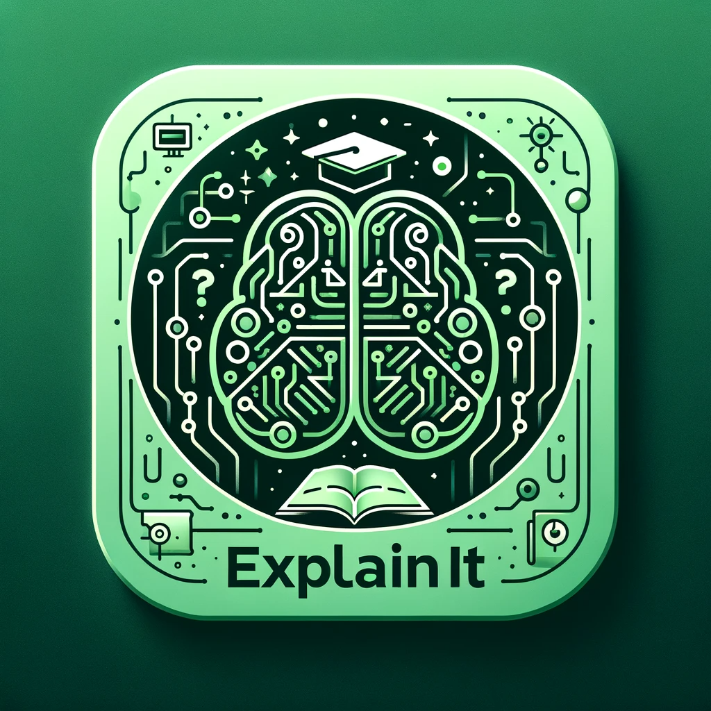
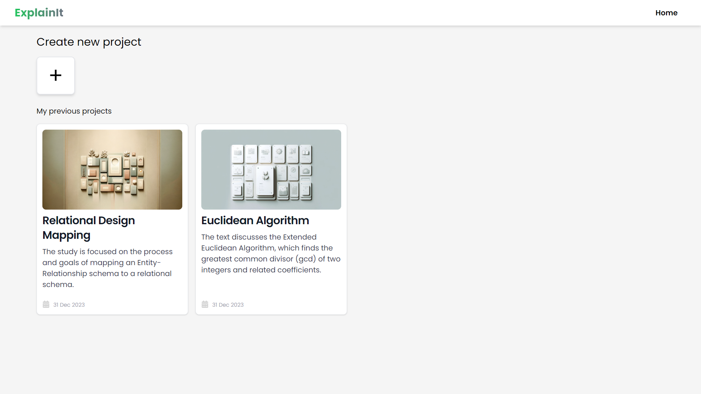
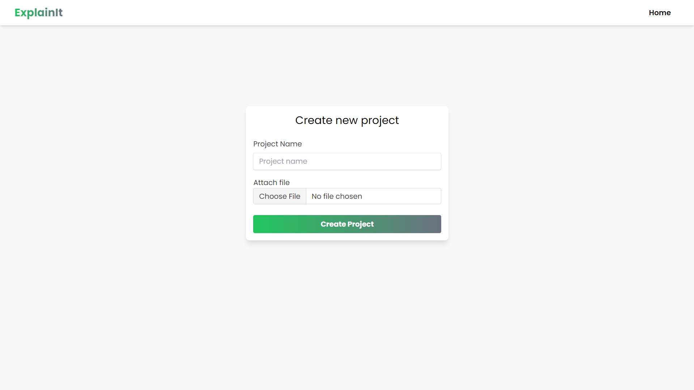
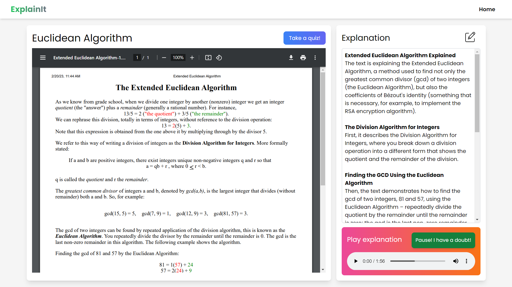
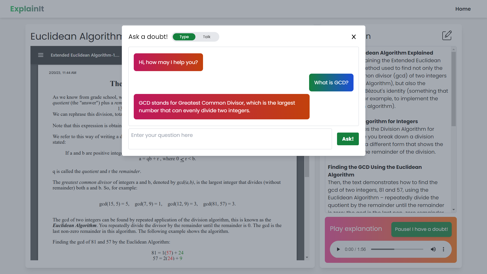
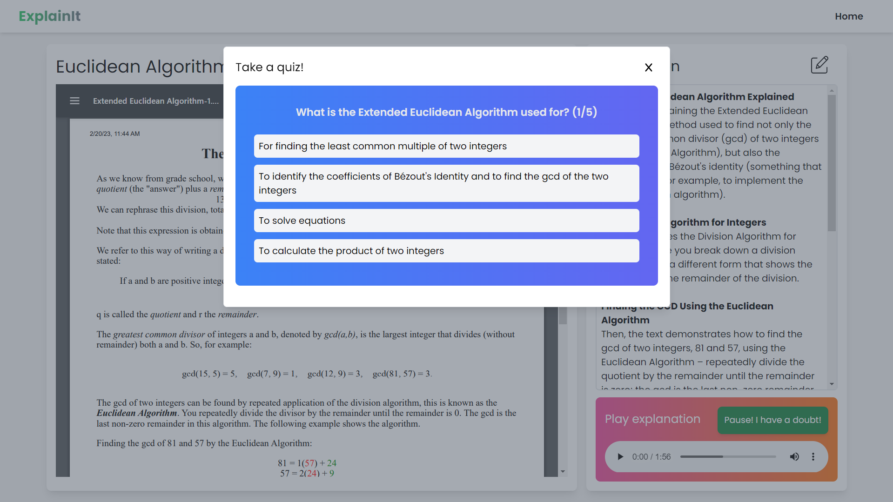
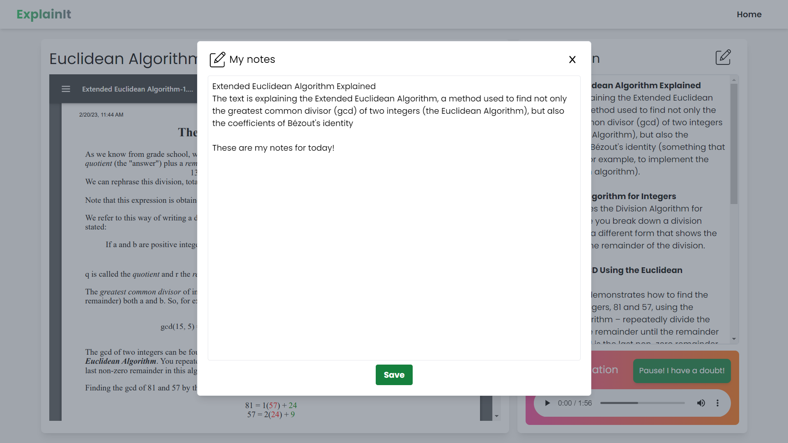

<h2 align="center">ExplainIt</h2>

       

ExplainIt is an AI-powered personal tutor. It's that friend who explains the entire test syllabus to you right before the exams but better. Just upload whatever PDF you wish to learn and ExplainIt explains it to you in an extremely simple fashion not just in a written format but also in audio! 

It boasts features such as text-to-speech, turning content into a dynamic dialogue with your very own personal teacher which can be paused whenever and to whom you can ask questions not only by typing but also by speaking, creating a very engaging and accessible learning journey.

Taking an individualized learning approach, ExplainIt has a completely dynamic quiz generation system that tests you on the contents of the PDF adding a gamified element to the learning experience. Additionally, users can create and store personal notes, building a valuable resource for future reference.

In summary, ExplainIt can be considered to be a dynamic learning companion, making education engaging, accessible, and tailored to individual needs. 

## Inspiration

In our academic journey, like any other student, we have often received course materials in the form of PDFs from professors. However, there were many instances where the instructors' explanations fell short or lacked clarity. This gap in traditional learning methods served as the catalyst for the creation of ExplainIt. Our motivation stems from the need to empower learners, especially in underprivileged communities to navigate educational content at their own pace, fostering a deeper understanding and clarity.

## How we built it

We built ExplainIt using React and TailwindCSS for the frontend, Node.js, and Firebase for the backend along with OpenAI's API integration. 

## How to run
- Clone this repository using `git clone https://github.com/SHARVAI101/pdf-teacher.git`
- Run `npm i` in both the client and server folders
- Run `npm start` in the client folder
- Run `node app` in the server folder
- Your personal tutor should be running on localhost:3000

## Screenshots

## Challenges we ran into

- Formatting the OpenAIs API response into more structured responses
- Building prompts for the quiz system.

## Accomplishments that we're proud of
- User-friendly UI that makes learning fun!
- An end-to-end fully functioning Web Application
- Building the all-AI-generated quiz system

## What we learned
- How to integrate AI into traditional web application systems.

## What's next for ExplainIt
- Translating explanations into languages other than English for students from more diverse backgrounds to be able to use our application
- Building more types of games into the quiz system like fill-in-the-blanks, match-the-following, etc.
- Adding a folder system for better organization of projects.
- Incorporating user authentication